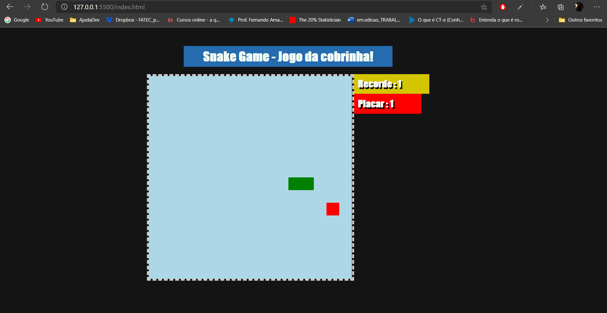

# Jogo da cobrinha desenvolvido com javascript

Este projeto está sendo desenvolvido durante o bootcamp HTML Web Developer, realizado na DIO: https://digitalinnovation.one/

## Gif!

## To do list (Próximos passos)

- Adicionar um placar para marcar o score atingido
- Um timer 
- Melhorar o visual
- Opção de reiniciar o jogo após game-over (um botão talvez?)
- colocar alguma trilha sonora da fundo